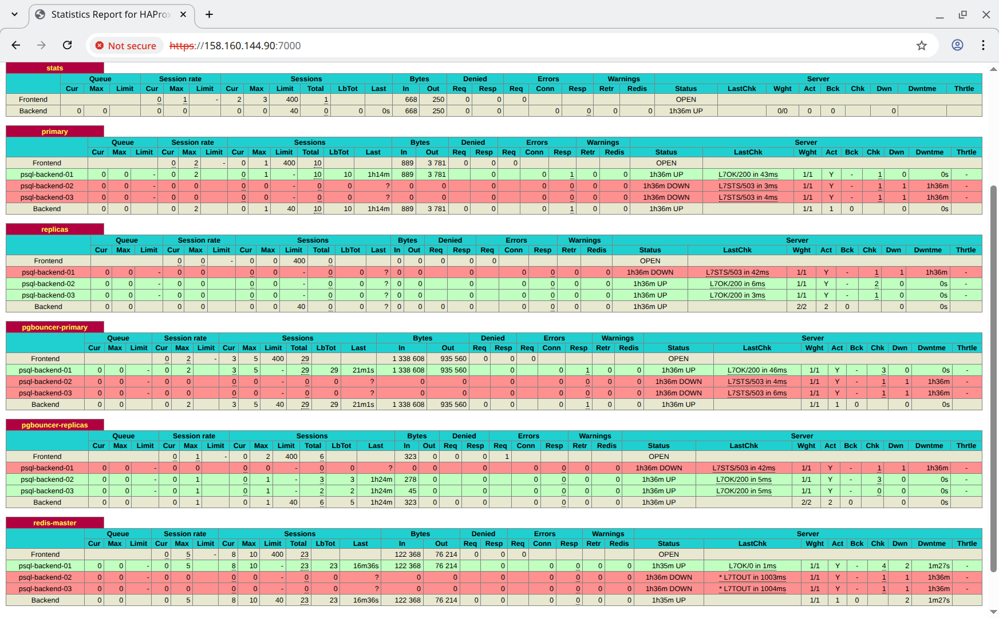
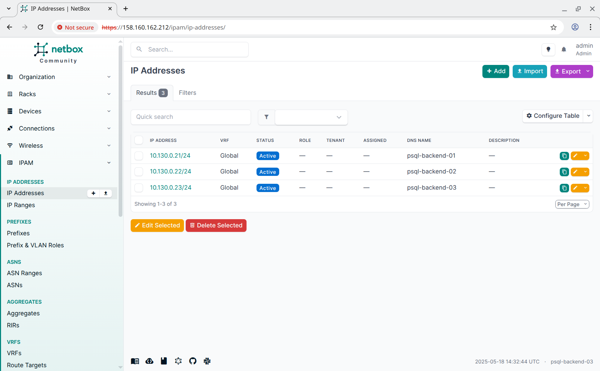

# Реализация кластера PostgreSQL с помощью Patroni

## Задание

Перевести БД веб проекта на кластер **PostgreSQL** с ипользованием **Patroni**, **etcd/consul/zookeeper** и **haproxy/pgbouncer**.

## Реализация

Задание сделано так, чтобы его можно было запустить как в **Vagrant**, так и в **Yandex Cloud**. После запуска происходит развёртывание следующих виртуальных машин:

- **psql-backend-01** - **NetBox**, **patroni**, **redis**, **angie**;
- **psql-backend-02** - **NetBox**, **patroni**, **redis**, **angie**;
- **psql-backend-03** - **NetBox**, **patroni**, **redis**, **angie**.

В независимости от того, как созданы виртуальные машины, для их настройки запускается **Ansible Playbook** [provision.yml](provision.yml) который последовательно запускает следующие роли:

- **angie** - устанавливает и настраивает **angie**;
- **apt_sources** - настраивает репозитории для пакетного менеджера **apt** (используется [mirror.yandex.ru](https://mirror.yandex.ru)).
- **bach_completion** - устанавливает пакет **bash-completion**.
- **chrony** - устанавливает **chrony** для синхронизации времени между узлами.
- **etcd** - устанавливает и настраивает кластер **etcd** для его дальнейшего использования **patroni**.
- **haproxy** - устанавливает и настраивает **haproxy** для проксирования запросов к **redis** и **postgresql**.
- **hosts** - прописывает адреса всех узлов в `/etc/hosts`.
- **keepalived** - устанавливает и настраивает **keepalived** при разворачивании в **vagrant**.
- **locale_gen** - генерит локаль **ru_RU.UTF-8** для последующего использования в **postgresql**.
- **netbox** - устанавливает и настраивает **netbox**.
- **patroni** - устанавливает и настраивает кластер **patroni**.
- **patroni_db** - создаёт базу данных в кластере **patroni** (определяет лидера и создаёт её на лидере).
- **patroni_facts** - собирает информацию о членах кластера **patroni** (определяет лидера).
- **patroni_privs** - настраивает права доступа к базам данных в кластере **patroni**.
- **patroni_user** - создаёт пользователей в кластере **patroni**.
- **pgbouncer** - устанавливает и настраивает **pgbouncer**.
- **pgdg_repo** - устанавливает репозиторий **pgdb** для **patroni** и **postgresql**.
- **redis** - устанавливает и настраивает **redis** (с репликацией на другие узлы).
- **redis_repo** - устанавливает и настраивает репозиторий для **redis**.
- **redis_sentinel** - устанавливает и настраивает **redis sentinel** для автоматического переключения мастера в кластере **redis**.
- **system_groups** - создаёт группы пользователей **Linux**.
- **system_users** - создаёт группы пользователей **Linux**.
- **tls_ca** - создаёт сертификаты для корневых центров сертификации.
- **tls_certs** - создаёт сертификаты для узлов.
- **tls_copy** - копирует серитификаты на узел.
- **wait_connection** - ожидает доступность виртуальных машин.

Данные роли настраиваются с помощью переменных, определённых в следующих файлах:

- [group_vars/all/angie.yml](group_vars/all/angie.yml) - общие настройки **angie**;
- [group_vars/all/ansible.yml](group_vars/all/ansible.yml) - общие переменные **ansible** для всех узлов;
- [group_vars/all/certs.yml](group_vars/all/certs.yml) - настройки генерации сертификатов для СУБД и **angie**;
- [group_vars/all/hosts.yml](group_vars/all/hosts.yml) - настройки для роли **hosts** (список узлов, которые нужно добавить в `/etc/hosts`);
- [group_vars/backend/angie.yml](group_vars/backend/angie.yml) - настройки **angie** для узлов **backend**;
- [group_vars/backend/certs.yml](group_vars/backend/certs.yml) - настройки генерации сертификатов для **backend**;
- [group_vars/backend/haproxy.yml](group_vars/backend/haproxy.yml) - настройки **haproxy**  для узлов **backend** (проксирования не лидера **patroni** и **redis**);
- [group_vars/backend/keepalived.yml](group_vars/backend/keepalived.yml) - настройки **keepalived** для узлов **backend**;
- [group_vars/backend/netbox.yml](group_vars/backend/netbox.yml) - настройки **netbox** для узлов **backend**;
- [group_vars/backend/patroni.yml](group_vars/backend/patroni.yml) - настройки **patroni** для узлов **backend**;
- [group_vars/backend/pgbouncer.yml](group_vars/backend/pgbouncer.yml) - настройки **pgbouncer** для узлов **backend**;
- [group_vars/backend/redis.yml](group_vars/backend/redis.yml) - настройки **redis** для узлов **backend**;
- [group_vars/backend/users.yml](group_vars/backend/users.yml) - настройки создания пользователей и групп на узлах **backend**;
- [host_vars/psql-backend-01/redis.yml](host_vars/psql-backend-01/mariadb.yml) - настройки **redis** для **psql-backend-01**;
- [host_vars/psql-backend-01/keepalived.yml](host_vars/psql-backend-01/keepalived.yml) - настройки **keepalived** для **psql-backend-01**;
- [host_vars/psql-backend-02/keepalived.yml](host_vars/psql-backend-02/keepalived.yml) - настройки **keepalived** для **psql-backend-02**;
- [host_vars/psql-backend-03/keepalived.yml](host_vars/psql-backend-03/keepalived.yml) - настройки **keepalived** для **psql-backend-03**.

## Запуск

### Запуск в Yandex Cloud

1. Необходимо установить и настроить утилиту **yc** по инструкции [Начало работы с интерфейсом командной строки](https://yandex.cloud/ru/docs/cli/quickstart).
2. Необходимо установить **Terraform** по инструкции [Начало работы с Terraform](https://yandex.cloud/ru/docs/tutorials/infrastructure-management/terraform-quickstart).
3. Необходимо установить **Ansible**.
4. Необходимо перейти в папку проекта и запустить скрипт [up.sh](up.sh).

### Запуск в Vagrant (VirtualBox)

Необходимо скачать **VagrantBox** для **bento/ubuntu-24.04** версии **202502.21.0** и добавить его в **Vagrant** под именем **bento/ubuntu-24.04/202502.21.0**. Сделать это можно командами:

```shell
curl -OL https://app.vagrantup.com/bento/boxes/ubuntu-24.04/versions/202502.21.0/providers/virtualbox/amd64/vagrant.box
vagrant box add vagrant.box --name "bento/ubuntu-24.04/202502.21.0"
rm vagrant.box
```

После этого нужно сделать **vagrant up** в папке проекта.

## Проверка

Протестировано в **OpenSUSE Tumbleweed**:

- **Vagrant 2.4.5**
- **VirtualBox 7.1.8_SUSE r168469**
- **Ansible 2.18.5**
- **Python 3.13.3**
- **Jinja2 3.1.6**

После запуска **NetBox** должен открываться по **IP** балансировщика. Для **Yandex Cloud** адрес можно узнать в выводе **terraform** в поле **load_balancer** (смотри [outputs.tf](outputs.tf)). Для **vagrant** это (можно использовать любой адрес):

- [https://192.168.56.51](https://192.168.56.51) - узел **psql-backend-01**.
- [https://192.168.56.52](https://192.168.56.52) - узел **psql-backend-02**.
- [https://192.168.56.53](https://192.168.56.53) - узел **psql-backend-03**.

Однако **keepalived** настроен таким образом, что при недоступности одного из узлов, его адрес переезжает на один из доступных.

Проверим работу кластера **etcd**:

```text
root@psql-backend-01:~# etcdctl endpoint status -w table
+--------------------------+------------------+---------+---------+-----------+------------+-----------+------------+--------------------+--------+
|         ENDPOINT         |        ID        | VERSION | DB SIZE | IS LEADER | IS LEARNER | RAFT TERM | RAFT INDEX | RAFT APPLIED INDEX | ERRORS |
+--------------------------+------------------+---------+---------+-----------+------------+-----------+------------+--------------------+--------+
| https://10.130.0.21:2379 | dfe9b3616ce3f55f |  3.5.21 |  344 kB |     false |      false |        18 |       1144 |               1144 |        |
| https://10.130.0.22:2379 | 6202c9d185e9805e |  3.5.21 |  352 kB |     false |      false |        18 |       1144 |               1144 |        |
| https://10.130.0.23:2379 | 203595bf9fae0634 |  3.5.21 |  352 kB |      true |      false |        18 |       1144 |               1144 |        |
+--------------------------+------------------+---------+---------+-----------+------------+-----------+------------+--------------------+--------+
```

Проверим работу кластера **patroni**:

```text
root@psql-backend-01:~# patronictl list
+ Cluster: 17-patroni (7505766679951925793) -----+-----------+----+-----------+
| Member          | Host        | Role           | State     | TL | Lag in MB |
+-----------------+-------------+----------------+-----------+----+-----------+
| psql-backend-01 | 10.130.0.21 | Leader         | running   |  4 |           |
| psql-backend-02 | 10.130.0.22 | Quorum Standby | streaming |  4 |         0 |
| psql-backend-03 | 10.130.0.23 | Quorum Standby | streaming |  4 |         0 |
+-----------------+-------------+----------------+-----------+----+-----------+
```

Проверим работу **redis sentinel** (пароль можно взять в файле `secrets/redis_password.txt`):

```text
root@psql-backend-01:~# redis-cli --askpass --insecure --tls -p 26379 info sentinel
Please input password: **************************
# Sentinel
sentinel_masters:1
sentinel_tilt:0
sentinel_tilt_since_seconds:-1
sentinel_running_scripts:0
sentinel_scripts_queue_length:0
sentinel_simulate_failure_flags:0
master0:name=mymaster,status=ok,address=10.130.0.21:6379,slaves=2,sentinels=3

root@psql-backend-01:~# redis-cli --askpass --insecure --tls -p 26379 sentinel ckquorum mymaster
Please input password: **************************
OK 3 usable Sentinels. Quorum and failover authorization can be reached
```

Проверим работу **haproxy** (имя пользователя **stats** пароль можно взять в файле `secrets/haproxy_stats_password.txt`):



Проверим работу **netbox** (имя пользователя **admin** пароль можно взять в файле `secrets/netbox_superuser_password.txt`):



Как видно из вывода **haproxy**, лидер для **patroni** и **redis** находится на первом узле, выключим его и проверим, что **netbox** продолжил работать. Для переключения узла лидера требуется некоторое время, после чего работа **netbox** полностью восстанавливается.

Если мы включим первый узел и заново подключимся к нему через **ssh**, то сможем увидеть, что лидеры переключились на другой узел:

```text
root@psql-backend-01:~# patronictl list
+ Cluster: 17-patroni (7505766679951925793) -----+-----------+----+-----------+
| Member          | Host        | Role           | State     | TL | Lag in MB |
+-----------------+-------------+----------------+-----------+----+-----------+
| psql-backend-01 | 10.130.0.21 | Quorum Standby | streaming |  5 |         0 |
| psql-backend-02 | 10.130.0.22 | Quorum Standby | streaming |  5 |         0 |
| psql-backend-03 | 10.130.0.23 | Leader         | running   |  5 |           |
+-----------------+-------------+----------------+-----------+----+-----------+

root@psql-backend-01:~# redis-cli --askpass --insecure --tls -p 26379 info sentinel
Please input password: **************************
# Sentinel
sentinel_masters:1
sentinel_tilt:0
sentinel_tilt_since_seconds:-1
sentinel_running_scripts:0
sentinel_scripts_queue_length:0
sentinel_simulate_failure_flags:0
master0:name=mymaster,status=ok,address=10.130.0.22:6379,slaves=2,sentinels=3
```
